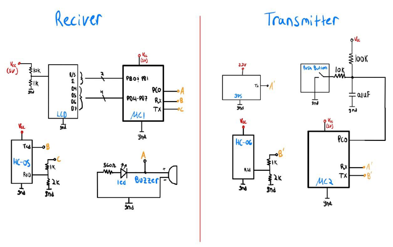

# Satellite-GPS-Emergency-System
When activated by a push button, this embedded system constantly transmits the user's current coordinates to a receiving device that sounds an alarm. When people are in an emergency situation, they are often unable to use their phone. This system allows users to contact help quickly and easily.

# Hardware

# ATmega328P Microcontroller
We used two microcontrollers, one for the receiver and one for the transmitter to run the system. We had used the ATmega328P microcontroller for the majority of the class, so our familiarity with the microcontroller made it ideal for this project.

# Adafruit Ultimate GPS Featherwing
We used the Adafruit Ultimate GPS Featherwing as our GPS module due to its wide use in industry and easy-to-read datasheet. The GPS module consistently transmitted an array of satellite coordinate data every second. We were only interested in the latitude and longitude coordinates, so the GPS data was parsed into tokens and compared to the strings we were looking for. Once we found the latitude and longitude coordinates, we printed them to the LCD and stopped parsing the GPS data. We ran into a lot of issues with the GPS module’s satellite connection, which was frustrating and caused timely delays. We eventually figured out that the Seaman center blocked the satellite signal, so we needed to go outside for a few minutes to get a good signal.

# HC-05/HC-06 Bluetooth Modules
We chose to use the HC-05 and HC-06 Bluetooth modules because they were sufficient for our usage and relatively inexpensive. The HC-05 module was the master Bluetooth module that established a Serial port connection with the microcontroller on the receiver device. The HC-06 module was used to transmit data to the master using the RX port. The TX of the microcontroller on the transmitter device was connected to the RX of the HC-06 module so data sent from the microcontroller would be sent to the HC-05. The RX of the receiver device’s microcontroller was connected to the TX of the HC-05 to collect the data it received. The data transfer from the HC-06 to the HC-05 was almost instantaneous. After binding the two Bluetooth modules, they automatically connected when powered on. We used a voltage divider to lower the voltage to 3.3V for the RX pin on both Bluetooth modules.

# Liquid Crystal Display
We used an HD44780U LCD screen to display various messages on the receiver board. When the program is initialized, the LCD displays “Waiting For Request”. This simply tells the operator that the button has not been pressed and nobody is “in need of help”. When the push button is pressed on the transmitting board, GPS coordinates are sent to the microcontroller, which are subsequently displayed on the LCD. From here, the LCD coordinates will be displayed until the receiving board is reset.

# Push Button
We used a push button to trigger the transmission of coordinates from the GPS module to the Bluetooth module. The push button was set low initially and pulled high when pressed. When the push button is released and the signal returns low, the transmission is cut off. We also used hardware debounce to reduce noise and provide the microcontroller with a stable, digital input signal. This debounce consisted of a 100K resistor, a 10K resistor, and a 0.01 uF capacitor. The 10K resistor and capacitor were used to make an RC filter that reduces noise and evens out the bounce into a more gradual curve.

# Software
The software for this project was written in C and consisted of one main loop that utilized a variety of different functions.For the transmitting code, we began by declaring the push button as an input, and then proceeded to initialize the USART, which is essentially the buffer that Bluetooth communicates through. While initializing, we set the baud rate, enabled the receiver and transmitter, and set the frame format. From here, we constantly read in the output from the GPS and hold it in a char array. This way, when the push button is pressed, the coordinates are already stored, and all we need to do is transmit the char array to the receiver board. After the original coordinates are sent, updated coordinates can be sent with each subsequent press of the push button. This way, if the person in need of help is moving, they can continue updating where they are.
For the receiving code, we began by declaring the buzzer and LED as outputs, and then proceeded to initialize the USART and LCD. We used the avr-libc library to handle the initialization and display settings of the LCD. This library allowed us to send full strings to the LCD without having to write our own functions. In the main loop of our code, we initialize a char array to hold the output coordinates of the GPS module. From there, we constantly read in the transmitted data from the Transmitting microcontroller. This data will always be null until the push button is pressed. So, when the push button is triggered, the transmitting microcontroller would send the output of the next GPS signal directly to the receiver. From here, we simply parse the string (by “,”) and extract the North and West coordinates that we want to display. Once we have these displayed on the LCD, we immediately sound the buzzer and turn on the LED for 10 seconds. After this, systems can be reset by pressing the reset button.
